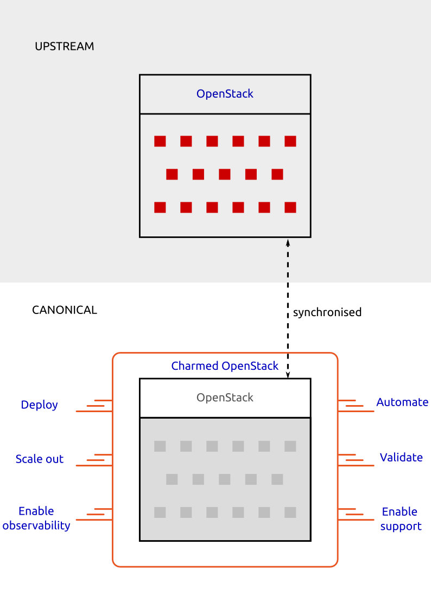

Working with your Charmed OpenStack solution
============================================

`Charmed OpenStack`_ is Canonical's charmed version of the upstream `OpenStack`_ solution.

[Using the diagram below, we are trying to show:

1. the difference between OpenStack and charmed OpenStack
#. the main actions that an existing customer can perform with a charmed OpenStack solution  ]

[ Ideally all the text in blue (or even whole components such as OpenStack and Charmed OpenStack) should be links. 
The links are listed below:

* `OpenStack`_
* `Charmed OpenStack`_
* `Deploy`_
* `Automate`_
* `Scale out`_
* `Validate`_
* `Enable observability`_
* `Enable support`_ ]

Optional Content
----------------

* What is it?
* What it isn't?
* Why use it?
* How to use it?
* How to get help?

.. _`Charmed OpenStack`: https://docs.openstack.org/charm-guide/latest/
.. _`OpenStack`: https://www.openstack.org/software/
.. _`Deploy`: https://ubuntu.com/tutorials/install-openstack-using-guided-installation-instructions#1-overview
.. _`Automate`: https://ubuntu.com/tutorials/use-the-deployment-manifest-to-benefit-from-full-automation-and-ia#1-overview
.. _`Scale out`: https://ubuntu.com/tutorials/scale-the-deployment-out-for-full-high-availability#1-overview
.. _`Validate`: https://ubuntu.com/tutorials/validate-the-deployment-to-make-sure-that-nothing-slips-through-the-cracks#1-overview
.. _`Enable observability`: https://ubuntu.com/tutorials/enable-the-observability-plugin-for-central-logging,-monitoring-and-alerting#1-overview
.. _`Enable support`: https://ubuntu.com/tutorials/enable-the-ubuntu-pro-plugin-for-enhanced-security-and-commercial-support#1-overview

