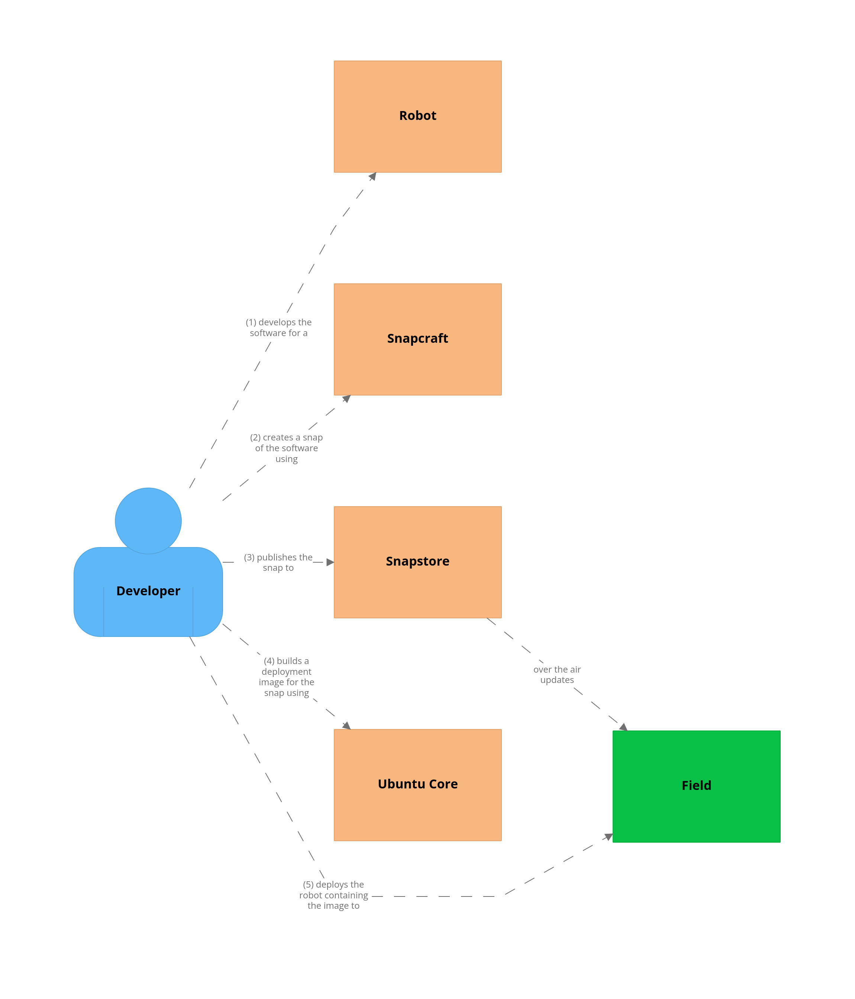

Robotics user journey - from development to deployment
======================================================

[ Through this diagram we are trying to show the steps followed by a robotics developer from the development of a robot to its large scale deployment. The different components depicting the different technologies used (Snapcraft, Snapstore and Ubuntu Core) would link to appropriate docs. ]

..
   .. raw:: html

  <embed>
   

   <map name="map">
   <area shape="rect" coords="901,774,1342,1058" href="https://snapcraft.io/docs" />
   <area shape="rect" coords="903,1367,1342,1658" href="https://snapcraft.io/store" />
   <area shape="rect" coords="900,1968,1343,2258" href="https://ubuntu.com/core/docs" />
   <area shape="rect" coords="903,170,1343,458" href="https://ubuntu.com/robotics/docs" />
   </map>
  </embed>

.. https://assets.ubuntu.com/v1/7e248369-structurizr-1-Robotics_User_Journey.png