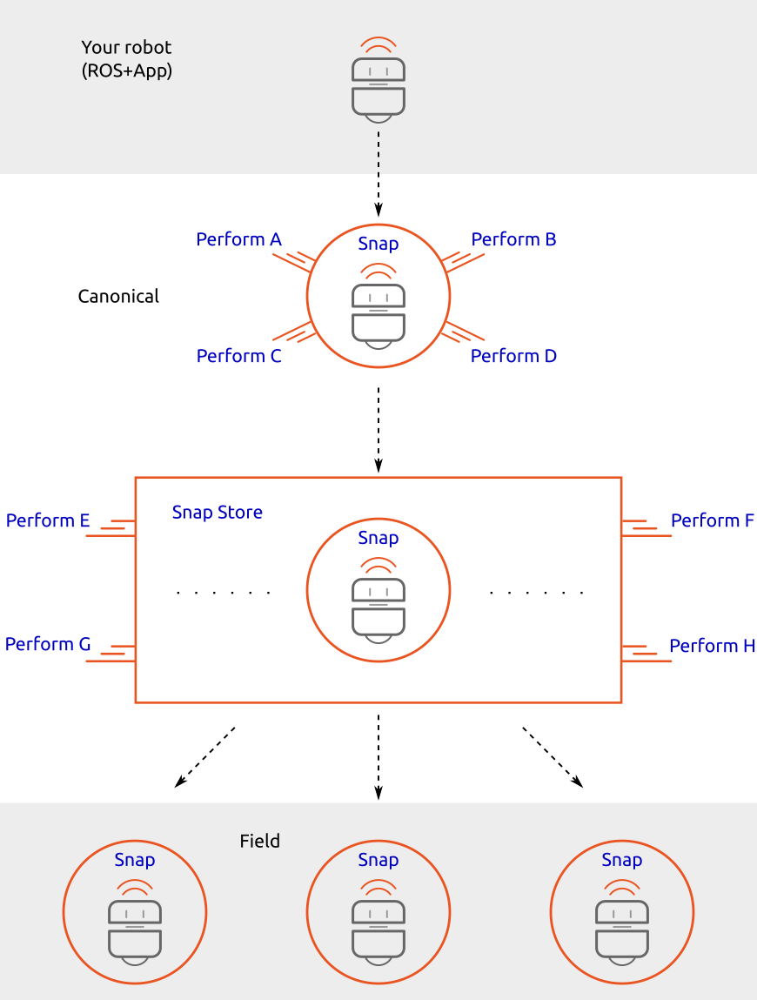

Getting your robots to perform in the field at scale
====================================================

[ Through this diagram we are trying to show how different technologies (ROS, snaps, snap store) are applied in the process of getting a robot into the field in a production ready state. The different components and text in blue would be links to appropriate docs. ]

